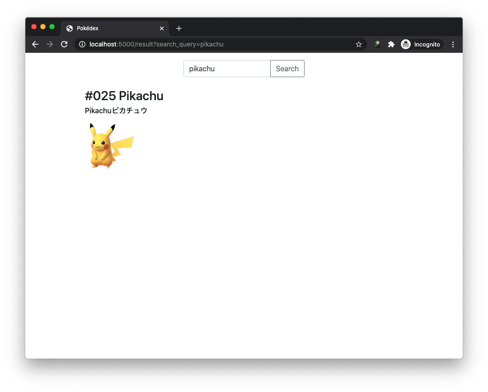

# Pokédex
This is my attempt in using Elasticsearch to build a very simple search engine, what would be a better project than 
building your own Pokédex.


### Dataset
The dataset I used for the project was found on Kaggle (https://www.kaggle.com/rounakbanik/pokemon)  

### How to use?
The whole project is dockerized so all you have to do is run the following command  
```
docker-compose up
```
Flask app - http://127.0.0.1:5000  
Elasticsearch - http://127.0.0.1:9200  
Kibana - http://127.0.0.1:5601  

### Search Examples
The search allows us to either search with english or japanese name of the pokemon  

You can also search for all pokemons of a given type   

